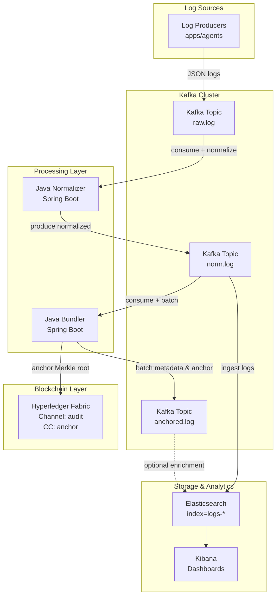

Below is a concise, production-grade **Final Design Document** for an immutable logging pipeline with **Kafka + Kafka Connect + Java Bundler + Hyperledger Fabric (anchor) + Elasticsearch + Kibana**.

---

# 1) Objectives & Scope

**Objectives**

* High-throughput, append-only logging with **tamper-evidence** via on-chain anchoring.
* Cost-efficient: store **hash commitments on Fabric**, full logs in ES.
* Fast search and visualization in **Kibana**; verifiable inclusion proofs per record.
* Operable at scale with clear SLOs, observability, and runbooks.

**Out of scope**

* Storing full logs on chain; cross-chain bridging; advanced ZK proofs.

  Service layout
```plaintext
immutable-logs/
  ingestor/          # consumes logs.raw, normalizes, salts+hashes, emits logs.norm
  batcher/           # windows records, builds Merkle, writes batch, anchors root
  proof-service/     # serves inclusion proofs + verifies
  query-api/         # search/index API (ClickHouse/OpenSearch)
  common/            # models, hashing/Merkle, shared utils
  contracts/         # (optional) Solidity + scripts (unchanged)
```

---

# 2) System Architecture



**Data flow**

5. **Kibana** visualizes; auditors can verify inclusion proofs by comparing record hash→Merkle path→anchored root.

---

# 3) Topics & Schemas

**Kafka topics**

* `logs.raw` — untrusted/raw JSON from producers.
* `logs.norm` — normalized, salted+hashed `LogRecord`.
* `logs.anchored` — batch anchor receipts (for async consumers/auditors).

**Avro/JSON schema (normalized)**

```json
{
  "type":"record","name":"LogRecord","namespace":"io.immutlog",
  "fields":[
    {"name":"record_id","type":"string"},
    {"name":"ts_nanos","type":"long"},
    {"name":"source","type":"string"},
    {"name":"level","type":"string"},
    {"name":"body","type":"string"},                  // encrypted or plain JSON
    {"name":"salt_b64","type":"string"},             // 32B random
    {"name":"hash_hex","type":"string"},             // 32B SHA-256
    {"name":"batch_id","type":["null","string"],"default":null},
    {"name":"offset_in_batch","type":["null","int"],"default":null}
  ]
}
```

---

# 4) Java Bundler Service

**Responsibilities**

* Consume `logs.norm`.
* Window by **time (e.g., 5s)** or **count (e.g., 50k)**.
* Compute **Merkle root** of leaf hashes (`hash_hex`), chain with `prev_root`.
* Submit **PutAnchor** to Fabric chaincode.
* Optionally update ES documents with `batch_id` and `offset_in_batch` (via a compact Kafka message to `logs.anchored` that a connector re-indexes or via ES update API directly).

**Key configuration (application.yaml)**

```yaml
spring:
  kafka:
    consumer:
      bootstrap-servers: ${KAFKA_BOOTSTRAP}
      group-id: bundler
      enable-auto-commit: false
      key-deserializer: org.apache.kafka.common.serialization.StringDeserializer
      value-deserializer: org.springframework.kafka.support.serializer.JsonDeserializer
      properties:
        spring.json.trusted.packages: "io.logchain"
bundler:
  window:
    ms: 5000
    maxRecords: 50000
  crypto:
    hash: "SHA-256"
fabric:
  networkConfig: /etc/fabric/connection.json
  channel: audit
  chaincode: audit_anchor
  mspId: Org1MSP
  certPath: /etc/fabric/identities/user.pem
  keyPath: /etc/fabric/identities/user.key
```

**Batch metadata**

```
BatchMeta {
  batchId: UUID
  count: long
  startTsNanos: long
  endTsNanos: long
  root: bytes32
  prevRoot: bytes32
  fabric: { channel, txId, blockNumber, anchorTs }
}
```

**Anchoring sequence**

1. Build Merkle root from `hash_hex` leaves (pairing, duplicate last if odd).
2. Call Fabric `PutAnchor(batchId, root, count, startTs, endTs, prevRoot)`.
3. Wait for commit event; capture `txId`, `blockNumber`.
4. Emit `logs.anchored` with `{batchId, root, txId, blockNumber, count, timeRange}`.
5. (Optional) Upsert ES records in this batch with `batch_id` and `offset_in_batch`.

**Idempotency**

* Derive `batchId` from Kafka offsets (`startOffset-endOffset` + topic + partition hash) or use UUID and persist a local **outbox** entry.
* On retry, check Fabric if `batchId` exists; if yes → skip.

---

# 5) Hyperledger Fabric (Anchor Chain)

**Channel:** `audit`
**Chaincode (TypeScript or Go):** `audit_anchor`

**State**

* Key: `batchId` (string/bytes)
* Value: `{root, count, startTsNanos, endTsNanos, prevRoot, anchorTs}`

**Functions**

* `PutAnchor(batchId, root, count, startTsNanos, endTsNanos, prevRoot)`

    * Require non-existence of `batchId`.
    * Emit `Anchored` event.
* `GetAnchor(batchId)` → Anchor
* `LatestAnchor()` → Anchor

**Endorsement policy**

* Quorum (e.g., `AND('Org1.member','Org2.member')`).

**Ordering service**

* Raft (3–5 orderers). Target < 2s commit latency in non-contentious loads.

**ACL**

* Only the anchoring application identity (or role) can invoke `PutAnchor`.

---

# 6) Elasticsearch Storage

**Index naming**

* `logs-YYYY.MM.DD` for daily rollover; ILM handles retention.

**Mappings (example)**

```json
PUT _index_template/logs-template
{
  "index_patterns": ["logs-*"],
  "template": {
    "settings": {
      "number_of_shards": 3,
      "number_of_replicas": 1,
      "index.lifecycle.name": "logs-ilm",
      "index.routing.allocation.total_shards_per_node": 2
    },
    "mappings": {
      "properties": {
        "record_id": {"type":"keyword"},
        "ts_nanos": {"type":"date_nanos"},
        "source": {"type":"keyword"},
        "level": {"type":"keyword"},
        "body": {"type":"text"},
        "salt_b64": {"type":"binary"},
        "hash_hex": {"type":"keyword"},
        "batch_id": {"type":"keyword"},
        "offset_in_batch": {"type":"integer"},
        "fabric": {
          "properties": {
            "tx_id":{"type":"keyword"},
            "block_number":{"type":"long"}
          }
        }
      }
    }
  }
}
```

**ILM policy**

```json
PUT _ilm/policy/logs-ilm
{
  "policy": {
    "phases": {
      "hot": {"actions": {"rollover":{"max_size":"50gb","max_age":"1d"}}},
      "warm":{"min_age":"7d","actions":{"forcemerge":{"max_num_segments":1}}},
      "cold":{"min_age":"30d","actions":{"freeze":{}}},
      "delete":{"min_age":"180d","actions":{"delete":{}}}
    }
  }
}
```

---

# 7) Kafka Connect → Elasticsearch

**Connector (Elasticsearch Sink)**

* Source: `logs.raw` or `logs.norm` (choose based on whether normalizer is inside Connect).
* Use SMTs to add processing time, rename fields, and set `_id` as `record_id` for idempotent upserts.

**Example config**

```json
{
  "name": "logs-to-es",
  "config": {
    "connector.class": "io.confluent.connect.elasticsearch.ElasticsearchSinkConnector",
    "tasks.max": "6",
    "topics": "logs.norm",
    "connection.url": "http://elasticsearch:9200",
    "key.ignore": "false",
    "key.converter": "org.apache.kafka.connect.storage.StringConverter",
    "value.converter": "org.apache.kafka.connect.json.JsonConverter",
    "value.converter.schemas.enable": "false",
    "behavior.on.null.values": "delete",
    "write.method": "upsert",
    "type.name": "_doc",
    "max.in.flight.requests": "1",
    "batch.size": "10000",
    "flush.timeout.ms": "120000",
    "max.buffered.records": "200000",
    "connection.username": "${file:/opt/secrets/es.properties:username}",
    "connection.password": "${file:/opt/secrets/es.properties:password}",
    "transforms": "AddTs",
    "transforms.AddTs.type": "org.apache.kafka.connect.transforms.InsertField$Value",
    "transforms.AddTs.timestamp.field": "ingest_ts"
  }
}
```

**Optional second connector** `logs.anchored → ES` to attach `{batch_id, offset_in_batch, fabric.tx_id, block_number}` to affected documents using ES Update by Query (or direct partial updates keyed by `record_id`).

---

# 8) Kibana Dashboards

**Core visualizations**

* **Ingest rate**: logs/sec by `source`, stacked.
  Query: `index=logs-* | date histogram on @timestamp or ts_nanos`
* **Error heatmap**: count where `level:ERROR` by `source` over time.
* **Anchor latency**: `anchor_latency_ms = fabric.anchor_ts - batch.end_ts` (derive and index in bundler).
* **Unanchored backlog**: logs in `logs.norm` without `batch_id` (exposed via metrics or a daily job marking anchored docs).
* **Top talkers**: sources generating most logs (terms agg on `source`).
* **Audit view (single record)**: doc panel showing `record_id`, `hash_hex`, `batch_id`, `fabric.tx_id`, a **“Verify Proof”** link (points to Proof API).

**Saved objects**

* Create a “Logging Overview” dashboard with the above visualizations and a filter bar on `source`, `level`, `time`.

---

# 9) Proofs & Verification

**Per-record**

* Recompute `hash = SHA-256(source || ts_nanos || body || salt)`.
* Load `merkle_path` & sibling order (bundler persists alongside batch metadata).
* Fold to `computed_root`; fetch on-chain `root` via Fabric Gateway `GetAnchor(batchId)`.
* Equal → verified.

**Exposure**

* `GET /proofs/{record_id}` → `{batch_id, merkle_path[], is_right[], root, fabric:{txId, blockNumber}}`
* `POST /verify` → `{ok, reason}`.

---

# 10) Security

* **Transport:** mTLS (Kafka, Fabric, ES if possible).
* **Authz:**

    * Fabric `PutAnchor` restricted to anchoring app identity/role.
    * Kafka ACLs: producers write only; bundler read `logs.norm`; connectors scoped.
    * ES/Kibana: SSO (OIDC), RBAC (read-only for auditors).
* **Encryption:**

    * At rest: ES encryption, Kafka disks, Fabric ledgers.
    * Log **body** can be AES-GCM with KMS DEKs (store nonce+tag with record).
* **PII:** tokenize or redact before hashing; salt every record.

---

# 11) Observability & SLOs

**Metrics (Prometheus via Micrometer in bundler)**

* `bundler_batches_total`
* `bundler_records_per_batch`
* `bundler_anchor_latency_ms` (p50/p95/p99)
* `bundler_anchor_failures_total`
* `kafka_consumer_lag_records` (by partition)
* `proof_verifications_total` / `proof_verifications_failed_total`

**SLOs**

* **Ingest-to-anchor median < 10s**, 95th < 30s.
* **Verification availability ≥ 99.9%**.
* **No data loss**: exactly-once batch anchoring semantics.

**Logging**

* Bundler logs request/response IDs for Fabric tx; correlate with Kibana via trace IDs (OpenTelemetry).

---

# 12) Capacity & Sizing (starter)

* Kafka: 3–5 brokers; 12–24 partitions for `logs.norm` (adjust to throughput).
* Connect: 3 workers; ES Sink tasks = min(partitions, 12).
* ES: start with 3 data nodes (hot), 2 warm; SSD; heap 50% of RAM (max 31GB).
* Fabric: 2 orgs × 2 peers; 3 Raft orderers.

---

# 13) Failure Handling & Runbooks

**Bundler cannot anchor (Fabric down):**

* Keep buffering up to backpressure thresholds; publish `AnchorDegraded` alert.
* Switch to **“intent only”** mode (persist batch metadata locally; retry anchoring loop).

**Connector backpressure:**

* Increase `max.buffered.records`, scale tasks, or throttle producers.
* ES overload: raise ILM rollover frequency; add warm nodes.

**Reprocessing / backfill:**

* Rewind consumer group offsets to re-emit `logs.norm` if normalization changed.
* Never reuse a `batchId`; if batch anchored then **immutable**.

**Key rotation / crypto-shredding:**

* Rotate KEKs; to “delete” bodies, destroy DEKs while keeping `hash_hex` and anchors.

---

# 14) Testing

* **Unit**: hashing determinism, Merkle tree/proofs, Fabric client idempotency.
* **Integration**: dockerized Kafka + ES + Fabric test network; assert anchor tx and ES documents updated.
* **Property tests**: randomized log sets → verify inclusion/non-inclusion.
* **Load**: step-load to target TPS; assert SLOs.

---

# 15) Minimal Interfaces & Snippets

**Fabric chaincode (TS) – PutAnchor**

```ts
@Transaction()
async PutAnchor(ctx: Context, batchId: string, root: string, count: number,
                startTs: number, endTs: number, prevRoot: string) {
  const key = ctx.stub.createCompositeKey("ANCHOR", [batchId]);
  const exists = await ctx.stub.getState(key);
  if (exists && exists.length) throw new Error("exists");
  const anchor = { root, count, startTs, endTs, prevRoot, anchorTs: Date.now() };
  await ctx.stub.putState(key, Buffer.from(JSON.stringify(anchor)));
  await ctx.stub.setEvent("Anchored", Buffer.from(JSON.stringify({ batchId, root })));
}
```

**Java (bundler) – Merkle**

```java
byte[] merkleRoot(List<byte[]> leaves) {
  if (leaves.isEmpty()) return new byte[32];
  var level = new ArrayList<>(leaves);
  while (level.size() > 1) {
    var next = new ArrayList<byte[]>((level.size()+1)/2);
    for (int i=0;i<level.size();i+=2) {
      var a = level.get(i);
      var b = (i+1<level.size()) ? level.get(i+1) : a;
      next.add(MessageDigest.getInstance("SHA-256").digest(Bytes.concat(a,b)));
    }
    level = next;
  }
  return level.get(0);
}
```

**Kafka Connect (anchored updates)**

* Produce `logs.anchored` with `{record_id, batch_id, offset_in_batch, fabric: {tx_id, block_number}}`.
* Use ES Sink with upsert, key=`record_id`, to add anchor fields.

---

# 16) Security Review Checklist

* [ ] Fabric identities stored in HSM or KMS-backed vault; no long-lived keys on disk.
* [ ] Kafka/ES/Fabric mTLS verified; cipher suites pinned.
* [ ] Connector secrets via externalized secret providers (e.g., file config provider).
* [ ] Kibana access limited; auditor role read-only.
* [ ] Data retention aligns with policy; ILM tested in staging.

---

# 17) Deliverables (what to implement from this doc)

1. **Spring Boot Java Bundler** (consumer, Merkle, Fabric Gateway client, metrics).
2. **Fabric chaincode** `audit_anchor` + channel setup.
3. **Kafka Connect** ES Sink configs (and optional anchored-update connector).
4. **Elasticsearch index template + ILM policy** from §6.
5. **Kibana “Logging Overview” dashboard** with panels from §8.
6. **Runbooks & alerts** (Prometheus rules + Grafana/Kibana).

If you want, I can output ready-to-use sample files (connector JSONs, ES template/ILM, chaincode skeleton, and a Spring Boot `application.yaml`) in one bundle.
